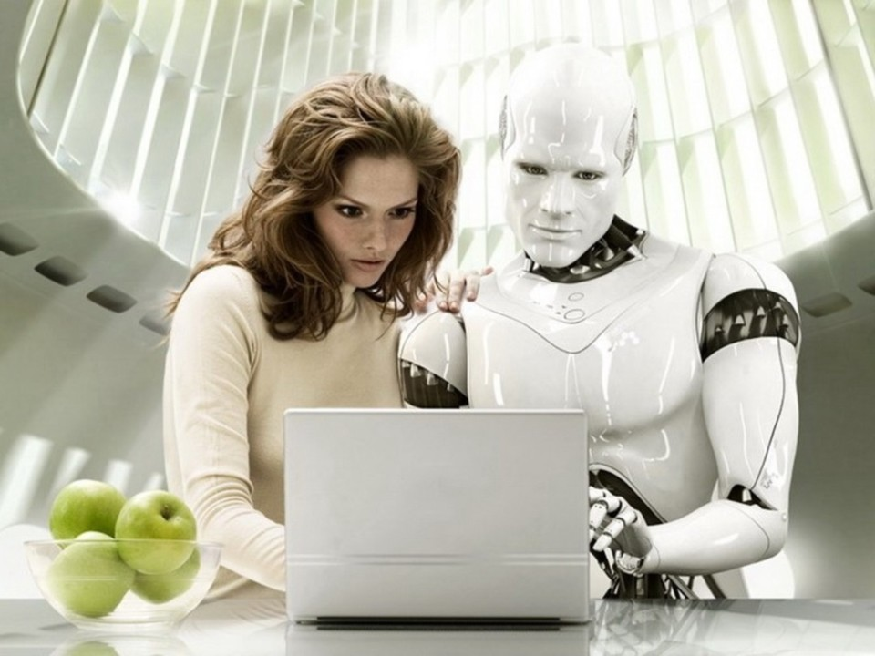
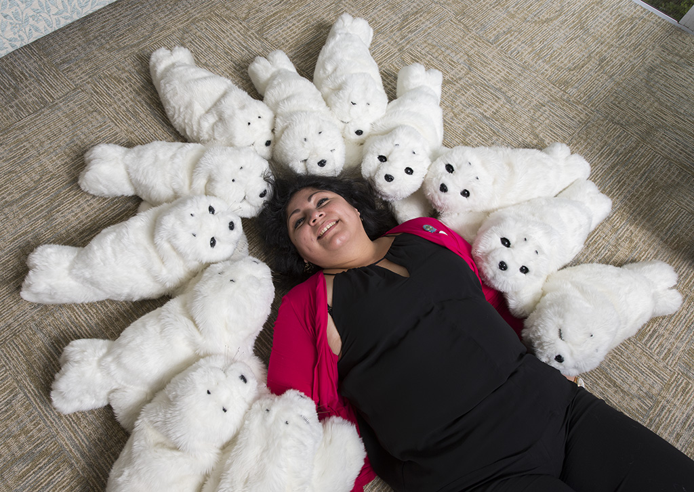
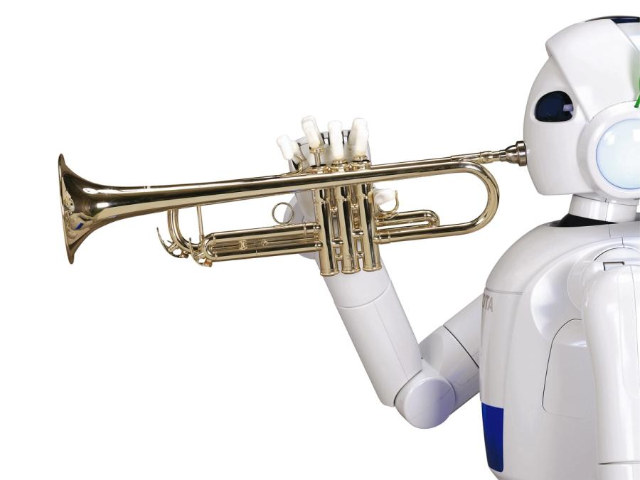

# HUMAN COMPANION

#### HUMANOID ROBOT

One of the key driving forces behind the development of humanoid robots as companions is the desire to address social isolation, a prevalent issue in today's fast-paced and digitally connected yet often lonely world. These robots, with their human-like appearance and interactive capabilities, offer a unique solution to combating feelings of loneliness, particularly among the elderly or those with limited social interactions.

Imagine a humanoid robot designed to engage in meaningful conversations, share jokes, and respond to human emotions. Such companions can provide a sense of connection and reduce feelings of isolation. For the elderly, who may experience social isolation due to various factors, having a humanoid robot as a companion could offer not only conversation but also assistance with daily tasks, thereby enhancing their overall quality of life.

Companion robots are not just talkers; they're gamers too! Discover the exciting world of interactive games designed specifically for human-robot interaction. Whether it's solving puzzles together or playing virtual board games, these robots add a new dimension to our gaming experiences.

One of the standout features of companion robots is their ability to engage in meaningful conversations. Imagine having a companion that not only listens but responds with humor, warmth, and intelligence. We'll explore how these robots use advanced language processing algorithms to provide not just information but also entertainment through engaging dialogues. The emotional intelligence of humanoid robots is a critical factor in their potential as companions. These machines are equipped with sensors and algorithms that allow them to recognize and respond to human emotions. This ability to empathize and adapt their behavior based on the emotional state of their human counterparts creates a more natural and fulfilling interaction, bridging the gap between man and machine.

 Humanoid robots have the capacity to serve as personalized caregivers. As the global population ages, the demand for caregiving services is growing, and humanoid robots can play a vital role in meeting these needs. From reminding individuals to take medication to assisting with household chores, these robots can offer practical support while also providing emotional companionship.

#### MENTAL HEALTH SUPPORT

In recent years, the integration of human companion robots into mental health care has garnered significant attention. These technologically advanced companions offer a range of benefits that contribute to the well-being of individuals facing mental health challenges.

The therapeutic benefits of human companion robots extend to mental health settings. Individuals facing conditions such as depression, anxiety, or post-traumatic stress disorder (PTSD) have experienced a positive impact through interactions with robots. The robot serves as a source of comfort, providing emotional support and a non-judgmental outlet for expression.
One key aspect of human companion robots is their ability to establish emotional connections with users. Through advanced AI algorithms, these robots can recognize and respond to human emotions, offering empathetic interactions that contribute to a sense of understanding and companionship.

One of the primary contributors to mental health challenges is social isolation. Human companion robots serve as constant companions, engaging users in conversations, games, and activities to mitigate feelings of loneliness and enhance social connectedness.
With machine learning capabilities, these robots can adapt to the unique needs of each user. By analyzing behavioral patterns and preferences, they can create personalized support plans, offering activities and interventions tailored to the individual's mental health goals.

Human companion robots are equipped with tools to assist users in managing anxiety and stress. This may include guided meditation sessions, deep-breathing exercises, and calming activities designed to promote relaxation and emotional well-being.
For individuals facing challenges with daily routines, human companion robots can play a crucial role. They provide reminders for medication, encourage healthy habits, and assist in establishing and maintaining a structured daily routine, contributing to overall mental health stability.

While the benefits are evident, it's essential to address ethical considerations surrounding the use of human companion robots in mental health care. Striking a balance between technology-driven support and human intervention is crucial to ensure a holistic and ethical approach to mental health support.

Human companion robots represent a promising frontier in mental health support, offering personalized, empathetic assistance to individuals facing mental health challenges. While ethical considerations and challenges persist, the potential impact on alleviating loneliness, reducing stress, and enhancing overall well-being positions these robots as valuable allies in the broader landscape of mental health care.

#### ENTERTAINMENT

In recent years, advancements in robotics have led to the creation of human companion robots that not only excel in tasks of assistance but also showcase remarkable musical talents. This blog delves into the fascinating realm of these entertainment-oriented robots, specifically focusing on their ability to play instruments such as the violin, flute, and more.
 As technology continues to evolve, engineers and designers have pushed the boundaries of what robots can achieve. Humanoid robots equipped with dexterous limbs and sophisticated algorithms are now capable of mastering musical instruments, bringing a new dimension to the world of entertainment.

Exploring the intricate algorithms and sensors that enable robots to play instruments with precision, this section highlights the technical aspects behind their musical prowess. From detecting pitch and rhythm to mimicking the nuanced expressions of a skilled musician, these robots showcase a blend of engineering and artistic finesse.

Introducing some of the standout humanoid robots designed for musical performances (Virtuoso), this part of the blog profiles cutting-edge creations that have captured the attention of audiences worldwide. Whether it's a robot virtuoso playing the violin with impeccable grace or a flute maestro captivating listeners, each robot brings its unique charm to the stage.
Highlighting instances where human musicians collaborate with their robotic counterparts, this part of the blog explores the exciting potential for synergy between humans and robots in musical performances. From orchestral arrangements to experimental collaborations, these partnerships showcase the harmonious blend of man and machine.

Discussing the hurdles in programming, adaptability to different musical genres, and the quest for emotional expression, this section provides insights into the ongoing innovations shaping the future of robotic musicianship.

Concluding the blog with a glimpse into the future, this section speculates on the evolving role of humanoid robots as entertainers. As technology continues to advance, what new horizons might we witness in the realm of robotic musicianship? The blog wraps up by inviting readers to ponder the potential for an era where robots become integral members of orchestras and ensembles.

 
